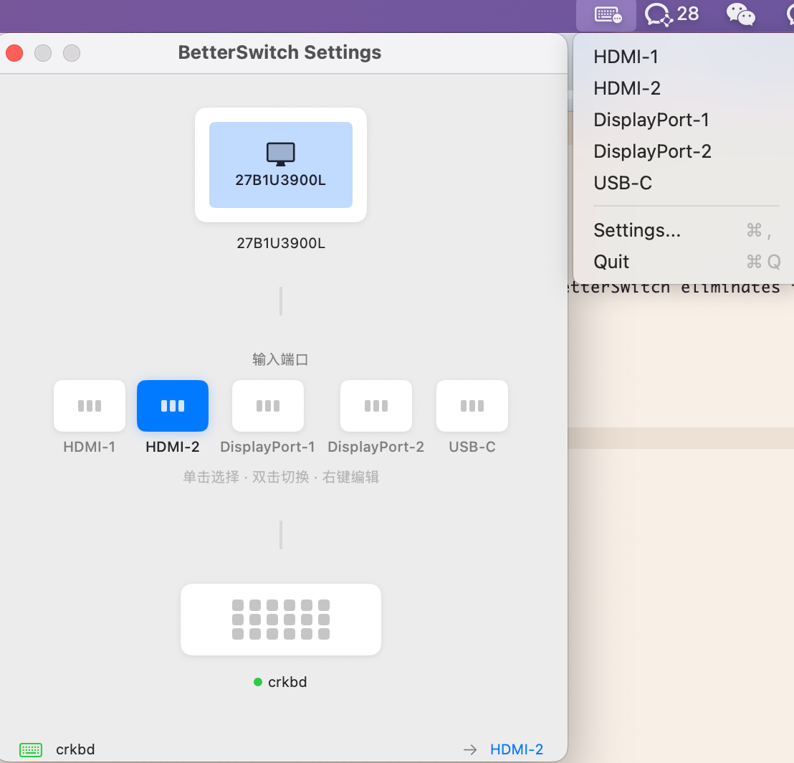

# BetterSwitch

Automatically switch your monitor's input source when you switch Bluetooth keyboards.



## What it does

If you use one monitor with multiple Macs (e.g., work laptop + personal Mac) and a Bluetooth keyboard that can pair with multiple devices, BetterSwitch eliminates the need to manually switch your monitor's input every time you switch keyboards.

**Before:** Switch keyboard → Walk to monitor → Press buttons → Switch input  
**After:** Switch keyboard → Done

## Features

- Detects Bluetooth keyboard activity (Classic BT & BLE)
- Sends DDC/CI commands to switch monitor input
- Runs silently in menu bar
- Simple one-page settings

## Requirements

- macOS 14.0+
- Apple Silicon Mac (M1/M2/M3)
- External monitor with DDC/CI support
- [m1ddc](https://github.com/waydabber/m1ddc) installed

## Installation

1. Install m1ddc:
   ```bash
   brew install m1ddc
   ```

2. Download BetterSwitch from [Releases](../../releases)

3. Move to Applications and open

4. Grant Bluetooth permission when prompted

## Setup

1. Click the keyboard icon in menu bar → Settings
2. Click the monitor to detect it
3. Select your input port (right-click to edit DDC ID if needed)
4. Click the keyboard to select your Bluetooth keyboard
5. Done! Switch keyboards and watch your monitor follow.

## Troubleshooting

**Monitor not detected?**
- Make sure it's connected via DisplayPort or HDMI (not USB-C hub)
- Check that your monitor supports DDC/CI

**Input not switching?**
- Verify m1ddc is installed: `which m1ddc`
- Test manually: `m1ddc set input 17` (17 = HDMI-1)
- Check the DDC ID matches your monitor's actual port

**Keyboard not detected?**
- Make sure Bluetooth is enabled
- The keyboard must be paired with this Mac

## DDC Input Codes

| Input        | Code |
|--------------|------|
| HDMI-1       | 17   |
| HDMI-2       | 18   |
| DisplayPort-1| 15   |
| DisplayPort-2| 16   |
| USB-C        | 27   |

Right-click any port in Settings to customize the DDC ID.

## License

MIT

## Acknowledgments

- [m1ddc](https://github.com/waydabber/m1ddc) - DDC/CI tool for Apple Silicon
